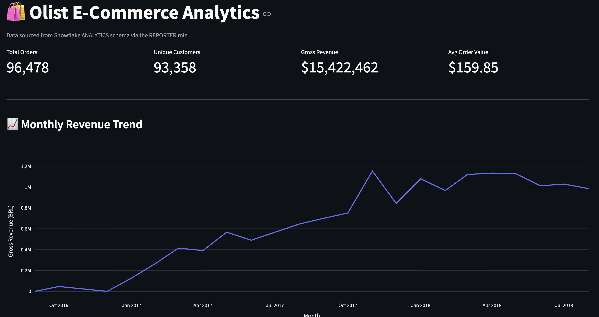
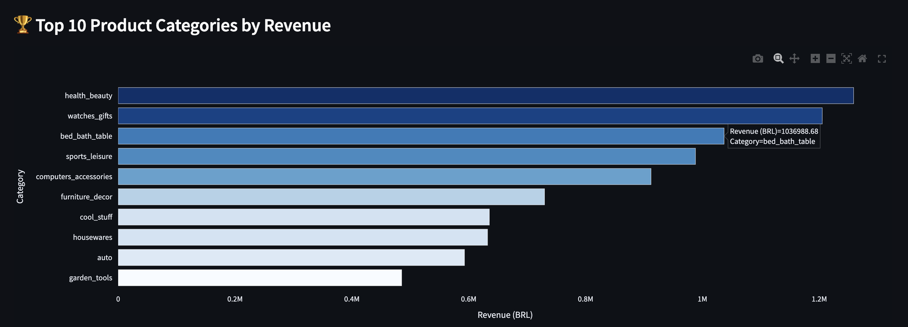
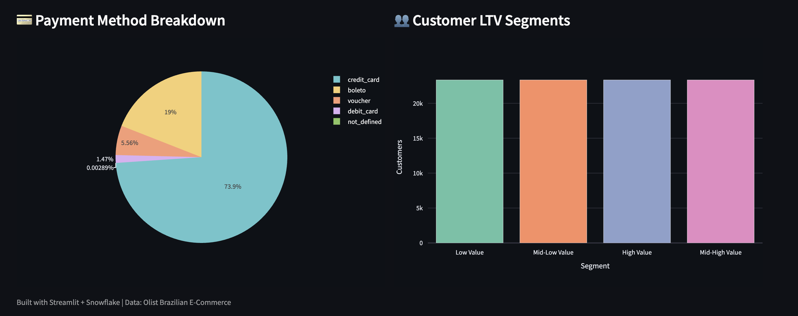

# Snowflake E-Commerce Analytics Pipeline


A portfolio-ready ELT pipeline that ingests real Brazilian e-commerce data into Snowflake, transforms it with dbt, and surfaces insights through a Streamlit dashboard.

```
Olist CSVs → AWS S3 → Snowflake (COPY INTO) → dbt (staging → intermediate → marts) → Streamlit
```

---

## Architecture

| Layer | Tool | Purpose |
|-------|------|---------|
| Source | [Olist / Kaggle](https://www.kaggle.com/datasets/olistbr/brazilian-ecommerce) | 100k+ real Brazilian e-commerce orders |
| Staging | AWS S3 | External stage / raw CSV landing zone |
| Warehouse | Snowflake | Storage, compute, and orchestration |
| Transform | dbt Core | SQL modeling, tests, and docs |
| Orchestration | Snowflake Tasks | Native daily scheduling |
| Visualization | Streamlit | Python dashboard |
| CI | GitHub Actions | `dbt build` on every pull request |

---

## Dashboard







---

## Project Structure

```
├── .github/workflows/ci.yml        # dbt build on every PR
├── snowflake_setup/                # One-time Snowflake SQL scripts
│   ├── 01_database_warehouse.sql
│   ├── 02_roles_grants.sql
│   ├── 03_storage_integration.sql
│   └── 04_tasks.sql
├── ingest/                         # Python S3 upload + COPY INTO SQL
│   ├── upload_to_s3.py
│   ├── copy_into.sql
│   └── requirements.txt
├── dbt_project/                    # dbt project root
│   ├── dbt_project.yml
│   ├── profiles.yml.example        # copy to ~/.dbt/profiles.yml
│   ├── models/
│   │   ├── staging/                # stg_*.sql — rename + cast
│   │   ├── intermediate/           # int_*.sql — joins, enrichment
│   │   └── marts/                  # fct_*, dim_*, monthly_revenue, customer_ltv
│   ├── tests/                      # Custom singular tests
│   └── macros/                     # Reusable SQL macros
├── dashboard/                      # Streamlit app
│   ├── app.py
│   └── requirements.txt
└── images/                         # Dashboard screenshots
```

---

## Quick Start

### Prerequisites

- Snowflake account (free trial at [snowflake.com](https://snowflake.com))
- AWS account with an S3 bucket in the same region as Snowflake
- Python 3.11+

### 1. Clone the repo and set up the virtual environment

```bash
git clone https://github.com/YOUR_USERNAME/Snowflake-E-Commerce-Analytics-Pipeline.git
cd Snowflake-E-Commerce-Analytics-Pipeline

# Create and activate a virtual environment
python3 -m venv .venv
source .venv/bin/activate  # Windows: .venv\Scripts\activate

# Install all dependencies
pip install dbt-snowflake streamlit>=1.40.0 pandas>=2.0.0 plotly>=5.20.0 boto3 python-dotenv
```

> **Note:** Always activate the venv (`source .venv/bin/activate`) before running any `dbt` or `streamlit` commands.

### 2. Configure environment variables

```bash
cp .env.example .env
# Fill in your AWS and Snowflake credentials
```

### 3. Run Snowflake setup scripts (once)

Open each file in the Snowflake UI or SnowSQL and run in order:

```
snowflake_setup/01_database_warehouse.sql   -- database, schemas, warehouse
snowflake_setup/02_roles_grants.sql         -- RBAC roles + grants
snowflake_setup/03_storage_integration.sql  -- S3 storage integration + external stage
snowflake_setup/04_tasks.sql               -- scheduled daily load task
snowflake_setup/05_network_policy.sql      -- required for external connections on trial accounts
```

### 4. Download Olist data and upload to S3

```bash
# Download CSVs from Kaggle and place them in data/
# https://www.kaggle.com/datasets/olistbr/brazilian-ecommerce
python ingest/upload_to_s3.py
```

### 5. Load raw data into Snowflake

Run `ingest/copy_into.sql` in the Snowflake UI against the LOADER role.

### 6. Configure dbt

```bash
cp dbt_project/profiles.yml.example ~/.dbt/profiles.yml
# Edit ~/.dbt/profiles.yml with your account/user/password
cd dbt_project
dbt debug     # verify connection
dbt deps      # install packages
```

### 7. Build dbt models

```bash
dbt build                    # runs all models + tests (55 total)
dbt compile --write-catalog  # generate catalog.json for docs (dbt-fusion 2.0)
```

### 8. Run the Streamlit dashboard

```bash
pip install -r dashboard/requirements.txt
streamlit run dashboard/app.py
```

---

## GitHub Actions CI

The workflow in `.github/workflows/ci.yml` runs `dbt build --target ci` against an ephemeral `CI` schema on every pull request. Add these secrets to your GitHub repo settings:

| Secret | Description |
|--------|-------------|
| `SNOWFLAKE_ACCOUNT` | Account identifier (e.g. `xy12345.us-east-1`) |
| `SNOWFLAKE_USER` | Snowflake username |
| `SNOWFLAKE_PASSWORD` | Snowflake password |

---

## dbt Model Layers

| Layer | Models | Materialization |
|-------|--------|----------------|
| Staging | `stg_orders`, `stg_customers`, `stg_products`, … | View |
| Intermediate | `int_orders_enriched`, `int_order_items_with_products` | Ephemeral |
| Marts | `fct_orders` (incremental), `dim_customers`, `dim_products`, `monthly_revenue`, `customer_ltv` | Table |

---

## What I Learned

- Designed a three-role RBAC model (LOADER / TRANSFORMER / REPORTER) mirroring production data warehouse governance.
- Implemented incremental loads using Snowflake Tasks and dbt's `incremental` materialization.
- Added 30+ data quality tests across staging and mart layers, including a custom singular test validating payment totals.
- Set up a CI pipeline that runs `dbt build` against an isolated CI schema on every PR.

---

## Resources

- [Snowflake COPY INTO docs](https://docs.snowflake.com/en/user-guide/data-load-overview)
- [Snowflake Tasks](https://docs.snowflake.com/en/user-guide/tasks-intro)
- [dbt Snowflake quickstart](https://docs.getdbt.com/quickstarts/snowflake)
- [Olist dataset on Kaggle](https://www.kaggle.com/datasets/olistbr/brazilian-ecommerce)
